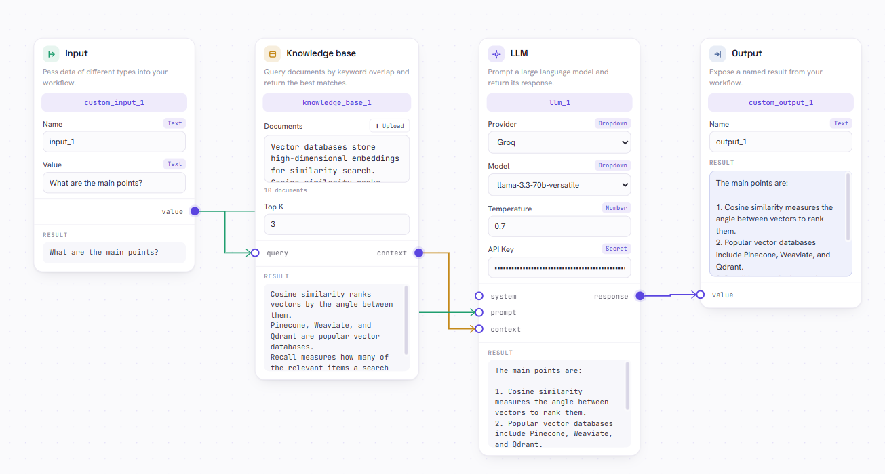
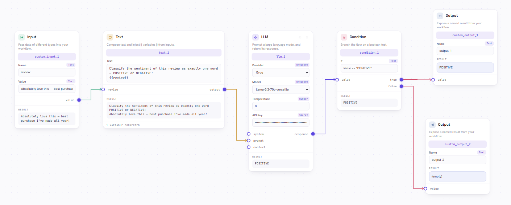

# VectorShift — Visual AI Pipeline Builder

Build AI workflows by **dragging boxes (“nodes”) onto a canvas and connecting them with arrows** — like drawing a flowchart that actually runs. You can retrieve documents, call a language model (LLM), branch on conditions, and see the result, all without writing code.

Built with **React + ReactFlow** (the part you see) and **Python + FastAPI** (the part that does the work).



> *Above: a question → Knowledge base → LLM → answer. Each box is a node; the lines are the data flowing between them.*

---

## ⭐ Two ways to use this

| | Way 1 — Live demo (easiest) | Way 2 — Run it on your computer |
|---|---|---|
| **What** | Open a link in your browser | Install & run both halves yourself |
| **Install anything?** | ❌ No | ✅ Node.js + Python |
| **Best for** | Just trying it out | Editing the code / grading the assessment |
| **Go to** | [**Way 1 ↓**](#-way-1--use-the-live-demo-no-install) | [**Way 2 ↓**](#-way-2--run-it-on-your-computer) |

---

## 🌐 Way 1 — Use the live demo (no install)

👉 **Open this link:** **https://vectorshift-pipeline-builder-inky.vercel.app/**

That’s it — it runs entirely in your browser, nothing to download.

To actually **run** a language model you just need a **free key** (it’s your key, used only for your run, never stored):

1. Get a free Groq key → https://console.groq.com/keys (sign in → “Create API Key” → copy the `gsk_…` value).
2. On the page, drag in an **LLM** node (or click **Import** and load an example), then paste the key into the LLM node’s **API Key** box.
3. Press **Run**. The right panel shows the result.

> Want a quick win? Click **Import**, choose one of the example pipelines from this repo’s **`Diagrams/`** folder (e.g. `pipeline-brief-generator.json`), add your key to the LLM node, and hit **Run**.

Now skip ahead to [**Step 3 — Try it**](#-step-3--try-it-the-fun-part). Everything there works on the live demo too.

---

## 💻 Way 2 — Run it on your computer

### 🧒 The simple idea

This project has **two halves** that run at the same time:

1. **The backend** — a small Python server. It does the thinking (checking your pipeline, running it).
2. **The frontend** — the website you click on in your browser.

You’ll open **two terminal windows**: one starts the backend, one starts the frontend. Then you open your browser and play.

> **Do I need a database?** No. The app works fully without one. A database (MongoDB) is only needed if you want the **“Save / My pipelines”** buttons to remember your work. You can skip it.

### 📦 Step 0 — Install the two tools you need

Do this once. Download and install both:

| Tool | What it’s for | Download |
|------|---------------|----------|
| **Node.js** (version 16 or newer) | runs the website | https://nodejs.org → click the big **LTS** button |
| **Python** (version 3.10 or newer) | runs the server | https://www.python.org/downloads → on Windows, **tick “Add Python to PATH”** during install |

**Check they installed.** Open a terminal (Windows: search “PowerShell”; Mac: open “Terminal”) and type:

```bash
node -v
python --version
```

If each prints a number (like `v20.11.0` and `Python 3.11.5`), you’re good. If Python says “not found”, try `python3 --version` and use `python3` everywhere below.

### ▶️ Step 1 — Start the backend (server)

Open a terminal and type these **one at a time** (press Enter after each). Use the real path to where you put this folder.

```bash
cd "path/to/frontend_technical_assessment/backend"
```

**Make a clean Python “sandbox” (recommended):**

<details>
<summary><b>Windows (PowerShell)</b></summary>

```powershell
python -m venv venv
venv\Scripts\Activate.ps1
```
If you get a red “running scripts is disabled” error, run this once, then try `Activate.ps1` again:
```powershell
Set-ExecutionPolicy -Scope Process RemoteSigned
```
</details>

<details>
<summary><b>Mac / Linux</b></summary>

```bash
python3 -m venv venv
source venv/bin/activate
```
</details>

**Install the server’s parts and start it:**

```bash
pip install -r requirements.txt
uvicorn main:app --reload
```

✅ **Success looks like:** `Uvicorn running on http://127.0.0.1:8000`.
**Leave this terminal open and running.** Closing it stops the server.

### ▶️ Step 2 — Start the frontend (website)

Open a **second** terminal (keep the first one running). Type:

```bash
cd "path/to/frontend_technical_assessment/frontend"
npm install
npm start
```

`npm install` downloads the website’s parts (takes a minute the first time). `npm start` launches it.

✅ **Success looks like:** your browser opens at **http://localhost:3000** and you see the pipeline builder. If it doesn’t open by itself, type that address in your browser.

🎉 **You’re running!**

---

## 🧪 Step 3 — Try it (the fun part)

The fastest way to see it work is to load a ready-made pipeline:

1. In the top toolbar, click **Import**.
2. Pick **`Diagrams/pipeline-brief-generator.json`**.
3. Click **Arrange** (bottom-left) to tidy it, then **Fit**.
4. Click the **LLM** node and paste a free API key into its **API Key** box (see below).
5. Press **Run** (top-right). The right panel opens automatically and shows the result.

You can also build your own: drag an **Input**, a **Knowledge base**, an **LLM**, and an **Output** onto the canvas, draw arrows between their little circles, and run.

Pipelines can also **branch**. Here a review is classified as POSITIVE/NEGATIVE, and a **Condition** node sends the result down a different path:



### 🔑 Get a FREE key to run the LLM

Paste a free API key into the **LLM node’s “API Key” box**. The easiest:

- **Groq** → https://console.groq.com/keys (key starts with `gsk_`).

It also supports Google Gemini, Cerebras, Mistral, Together, and SambaNova — pick the provider in the LLM node’s dropdown, then paste that provider’s key. Your key is used only for the call and is **not saved** to any server.

> No key yet? You can still build pipelines, **Check** them (counts + DAG validation), and run the offline nodes (Knowledge base, Vector store, Math, etc.) without a key.

### 📚 Using documents (Knowledge base & Vector store)

The **`samples/`** folder has ready-to-use document files:

- `samples/knowledge-base.txt` — facts about vector databases (for the **Knowledge base** node)
- `samples/vector-store.txt` — support-style snippets (for the **Vector store** node)

On either node, click **⬆ Upload** and pick the file (or drag the file onto the documents box). Each line becomes one document.

---

## 🗂️ What’s in each folder

| Folder / file | What it is |
|---------------|------------|
| `frontend/` | The website (React). Source code lives in `frontend/src`. |
| `backend/` | The Python server (FastAPI). |
| `samples/` | Document files to upload into Knowledge base / Vector store nodes. |
| `Diagrams/` | Example pipelines you can **Import** (`*.json`) plus screenshots (`*.png`). |
| `backend/.env.example` | Template for backend settings (copy to `backend/.env` if you use a database). |
| `frontend/.env.example` | Template for the frontend (only if your backend isn’t on `localhost:8000`). |

---

## 💾 Optional — turn on Save / “My pipelines” (needs a database)

Skip unless you want the app to remember saved pipelines.

1. Make a **free** MongoDB database at https://www.mongodb.com/cloud/atlas and copy its connection string.
2. In `backend/`, copy the template and fill it in:
   ```bash
   # Windows:   copy .env.example .env
   # Mac/Linux: cp .env.example .env
   ```
   Open `backend/.env` and set:
   ```env
   MONGO_URI=mongodb+srv://<user>:<password>@<cluster>.mongodb.net/?appName=<app>
   ```
3. Restart the backend (`Ctrl + C`, then `uvicorn main:app --reload` again).

Now **Save** and **My pipelines** work.

---

## 🆘 Troubleshooting

| Problem | Fix |
|---------|-----|
| `python` not found | Try `python3`. On Windows, reinstall Python and tick **“Add Python to PATH.”** |
| `uvicorn` not found | Run `pip install -r requirements.txt` again (and make sure you’re in the `backend` folder). |
| Website loads but **Run/Check** says “can’t reach the server” | The backend terminal isn’t running — go back to Step 1. |
| PowerShell blocks `Activate.ps1` | Run `Set-ExecutionPolicy -Scope Process RemoteSigned`, then try again. |
| LLM node errors “No API key” | Paste a free key into the LLM node’s **API Key** box. |
| Port already in use | Start the backend elsewhere: `uvicorn main:app --reload --port 8001`, then put `REACT_APP_API_URL=http://localhost:8001` in `frontend/.env`. |

---

## 🧠 What this project demonstrates (the assessment)

Built for the VectorShift frontend assessment — all four parts implemented:

1. **Node abstraction** — every node is one shared `BaseNode` + a small declarative `fields` list, so a new node is ~10 lines. **18 node types** are included (the brief asked for 5).
2. **Styling** — a unified, modern design (white node cards, a category-tabbed parts bar, a side inspector).
3. **Text node logic** — the Text node **grows** as you type, and typing `{{ variable }}` adds a matching **input handle** on its left.
4. **Backend integration** — **Check pipeline** sends the graph to `/pipelines/parse`; the backend returns `{ num_nodes, num_edges, is_dag }`, shown in an alert.

Beyond the brief: a real **run engine** (executes the pipeline through LLM/retrieval/logic nodes), **Import/Export**, **Auto-arrange**, and optional **MongoDB** persistence.

---

## ⚙️ Tech summary

- **Frontend:** React 18, ReactFlow 11, Zustand (state). Runs on **:3000**.
- **Backend:** FastAPI, Uvicorn, Motor (MongoDB), httpx. Runs on **:8000**. Needs **Python 3.10+**.
- **Config (all optional for local use):** `REACT_APP_API_URL` (frontend) and `MONGO_URI` / `CORS_ORIGINS` (backend).
- **Live demo:** https://vectorshift-pipeline-builder-inky.vercel.app/
